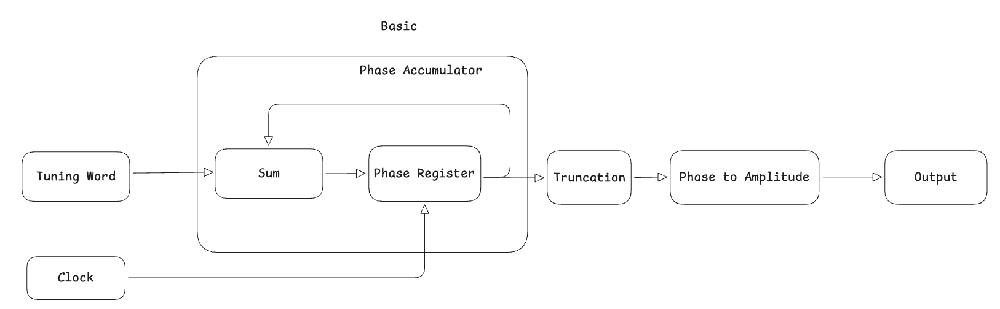
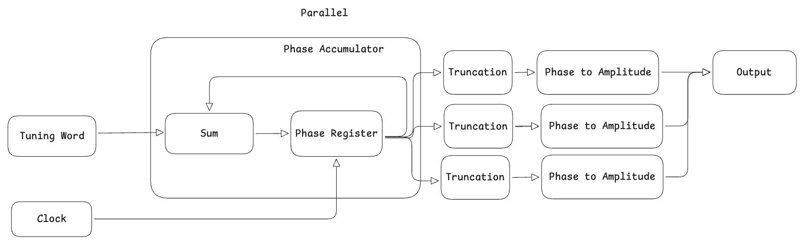

# AVLSI Open Project

## Direct Digital Synthesizer

A direct digital synthesizer allows a system to produce digitized samples of a
sinusoid. In this project, we will demonstrate the functionality of one in
verilog and work through the optimization of it.

### Basic Verilog Structure



The basic process of a direct digital synthesizer is:

1. A tuning word is given to set the desired frequency
2. Every rising edge the phase accumulator adds this value to itself wrapping
   back around when necessary
3. This phase value goes through a quantizer to decrease the size
4. This truncated phase value is now maped to an amplitude value in memory
5. Finally this value is outputed

### Phase Accumulator

For the Direct Digital synthesizer, we begin with the phase accumulator. We take
in an input of a
tuning word to set the step value of the phase accumulator. This then steps the
accumulated value up until hitting the cap, then circles back.

``` verilog
module phase_accumulator
  #(
    parameter TUNING_WIDTH = 16,
    parameter PHASE_WIDTH = 24
    )
  (
   input                    clk, en,
   input [TUNING_WIDTH-1:0] tuning_word,
   output reg [PHASE_WIDTH-1:0]  phase
   );

   always @(posedge clk) begin
     if (en == 1'b1)
       begin
          phase <= phase + {{(PHASE_WIDTH-TUNING_WIDTH){1'b0}}, tuning_word};
       end
   end

endmodule // phase_accumulator
```

### Quantizer

The quantizer takes the output from the phase accumulator and takes the most
significant bits in order to limit the non useful data for a smaller
implementation. In this case it pairs it down from 24 bits to 16 bits.

``` verilog
module quantizer
  #(
    parameter INPUT_WIDTH = 24,
    parameter OUTPUT_WIDTH = 16
    )
   (
    input [INPUT_WIDTH-1:0] in,
    output [OUTPUT_WIDTH-1:0] out
    );

   assign out = in [INPUT_WIDTH-1:INPUT_WIDTH-OUTPUT_WIDTH]; 
   // truncate by width difference

endmodule // quantizermodule quantizer #() ();

endmodule
```

### Phase to Amp Converter

``` verilog
module phase_to_amp_conv #(
parameter DATA_WIDTH = 16,
parameter AMP_WIDTH = 16)
(input [DATA_WIDTH-1:0] trunc_phase,
output reg [AMP_WIDTH-1:0] amp);
always @(*) begin
  case (trunc_phase)
    16’d0: amp = 16’d32768;
    …
    default: amp = 16’h0;
  endcase
end
endmodule
```

### Complete Process

All together we build this out to create the pull outline.

``` verilog
module basic
#(
  parameter TUNING_WIDTH = 16,
  parameter DATA_WIDTH = 16,
  parameter PHASE_WIDTH = 24, // 24 - 48 bits
  parameter AMP_WIDTH = 16
  ) 
 (
  input                    clk, en,
  input [TUNING_WIDTH-1:0] tuning_word,
  output [DATA_WIDTH-1:0]  output_data
  );

 wire [PHASE_WIDTH-1:0] phase;
 wire [DATA_WIDTH-1:0] trunc_phase;
 reg [AMP_WIDTH-1:0]   amp;

 phase_accumulator
   pa
 (
  .clk(clk), 
  .en(en), 
  .tuning_word(tuning_word),
  .phase(phase)
  );

 quantizer quant (.in(phase), .out(trunc_phase));

 phase_to_amp_conv ptac (trunc_phase, amp);

 assign output_data = amp;
endmodule
```

## Quantization

Filter frequency response of the original (un-quantized) filter and quantized
filter, comments/thoughts about the quantization effect, and anything you did to
deal with overflow

## Parallelized



In order to allow more throughput per clock cycle, we can implement a parallel
structure as seen in the figure above.

## Hardware Implementation Results

Detailed hardware implementation results (e.g., area, clock frequency, power
estimation)

## Analysis

## Conclusion
